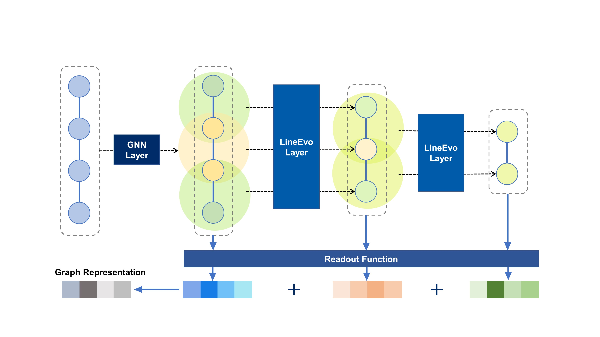

## Enhancing molecular representations via graph transformation layers
This is the official implentation of LineEvo: "Enhancing molecular representations via graph transformation layers". we proposed a flexible and simple graph transformation layer (i.e. LineEvo), a plug-and-use module for GNNs, which enables molecular representation learning from multiple perspectives. The LineEvo layer transforms fine-grained molecular graphs into coarse-grained ones based on the line graph transformation strategy. Especially, it treats the edges as nodes and generates the new connected edges, atom features, and atom positions. By stacking LineEvo layers, GNNs can learn multi-level information, from atom-level to triple-atoms level and coarser level. Experimental results show that the LineEvo layers can improve the performance of traditional GNNs on molecular property prediction benchmarks on average by 7%.


## Datasets
All the raw datasets except the QM9 (which is very large) are lied in 'dataset/raw_files/'. The QM9 dataset can be download [here](https://deepchemdata.s3-us-west-1.amazonaws.com/datasets/molnet_publish/qm9.zip).

## How to run
- train LineEvo on datasets (delaney, freesolv, lipo, bace, bbbp)

```python train_main.py -desc [desc] -model [model] -dataset [dataset]```
  - `desc`: Description for the saving results' names
  - `model`: `Add` or `LineEvo` (the former means normal GNN models, the latter is the model this paper proposed)
  - `dataset`: file name in the `dataset/raw_files` e.g. `freesolv`

- hyper-parameters search for each dataset

```python hyper_search.py -desc [desc] -model [model]```

- train LineEvo on QM9 dataset (to be added)

## Cite
If you use FFiNet in your research, please cite:
  ```@Article{Ren2023,
  author={Ren, Gao-Peng
  and Wu, Ke-Jun
  and He, Yuchen},
  title={Enhancing Molecular Representations Via Graph Transformation Layers},
  journal={Journal of Chemical Information and Modeling},
  year={2023},
  month={Apr},
  day={27},
  publisher={American Chemical Society},
  issn={1549-9596},
  doi={10.1021/acs.jcim.3c00059},
  url={https://doi.org/10.1021/acs.jcim.3c00059}
  }```
